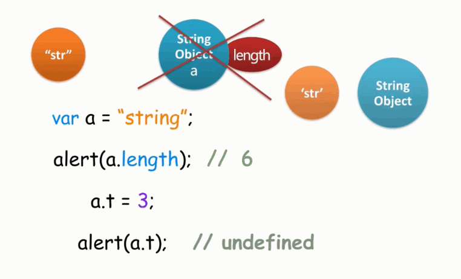

# 第 1 章 数据类型

## 1-1 深入浅出课程介绍

略

## 1-2 六种数据类型

原始类型（基本类型）：

- `number`
- `string`
- `boolean`
- `null`
- `undefined`

除此之外，JavaScript 还有一种对象类型（复合类型）`object`。

`object` 包含以下类型：

- `Function`
- `Array`
- `Date`
- ...

## 1-3 隐式转换

关于`+`和`-`：
`+`隐式转为字符串，`-`隐式转换为数字。

```js
'37' - 7 // 30
'37' + 7 // 377
```

因此可以巧用`+`和`-`转换数据类型，比如使用`- 0`（减 0），转换为数字，使用`+ ''`（加空字符串）转换为字符串。

因此可以巧用`+`和`-`转换数据类型，比如使用`- 0`（减 0），转换为数字，使用`+ ''`（加空字符串）转换为字符串。

## 1-4 包装对象

[1-2 六种数据类型](#1-2-六种数据类型) 中介绍的 5 种基本类型和一种对象类型，其中 5 中基本类型都有其对应的包装类型。

当把一个基本类型作为对象使用时，JavaScript 会尝试将基本类型转换为包装对象，想定于 new 了一个临时对象，对象的值为基本类型的值。

使用基本对象访问对象的方法后，这个临时对象会被销毁掉，所以再次访问对象的方法时就会变成 undefined。

如下图：


::: warning
图片名中不能出现`#`，否则会会有问题：

1. Markdown 插入图片的方式，不能显示图片
2. HTML 插入图片的方式会报错。
   :::

## 1-5 类型检查

JavaScript 中检查类型的方法有很多，比如：

- `typeof`
- `instanceof`
- `Object.prototype.toString`
- `constructor`

  注意：使用 textlint 时，报`TypeError: entry.split is not a function`，所以上面加了引号。

- duck type

### `typeof`

`typeof`返回一个字符串，它非常适合函数对象和基本类型的判断。

比如：

|                 命令 | 结果        |
| -------------------: | :---------- |
|           typeof 100 | "number"    |
|          typeof true | "boolean"   |
| typeof function() {} | "function"  |
|      typeof Function | "function"  |
|     typeof undefined | "undefined" |
|          typeof null | "object"    |
|  typeof new Object() | "object"    |
|        typeof [1, 2] | "object"    |
|           typeof NaN | "number"    |

### `instanceof`

`instanceof`常用于对象类型的判断，它是基于`原型链`的形式去判断的操作符。

它期望左操作树是一个对象，如果不是对象而是基本类型的话，直接返回 false。

|                    命令 | 结果  |
| ----------------------: | :---- |
|     1 instanceof Number | false |
| true instanceof Boolean | false |

它期望右操作树是一个函数对象，或函数构造器，如果不是的话就会跑出一个 TypeError 异常。

|                          命令 | 结果  |
| ----------------------------: | :---- |
|       [1, 2] instanceof Array | true  |
| new Object() instanceof Array | false |

`instanceof`的大概原理就是它会判断左边的操作树的对象的原型链上，是否有右边的构造函数的 prototype 属性。

例子：

::: normal-demo instanceof demo

```js
function Person() {}
function Student() {}
Student.prototype = new Person()
Student.prototype.constructor = Student
var bosn = new Student()
console.log(bosn instanceof Student)
var one = new Person()
console.log(one instanceof Person)

console.log(one instanceof Student)
console.log(bosn instanceof Person)
```

:::

打开开发者工具看结果，或者打开 Codepen 在线调试。

::: tip
Caution!
不同 window 或 iframe 间的对象类型检查不能使用 instanceof!
:::

### `Object.prototype.toString`

|                                          命令 | 结果                 |
| --------------------------------------------: | :------------------- |
|           Object.prototype.toString.apply([]) | "[object Array]"     |
| Object.prototype.toString.apply(function(){}) | "[object Function]"  |
|         Object.prototype.toString.apply(null) | "[object Null]"      |
|    Object.prototype.toString.apply(undefined) | "[object Undefined]" |

::: tip
IE6/7/8 Object.prototype.toString.apply(null)返回"[object Object]"
:::

### 类型检查小结

- `typeof`
  适合基本类型及 function 检测，遇到 null 失效。
- `Object.prototype.toString`
  通过 Object.prototype.toString 拿到，适合内置对象和基本类型，遇到 null 和 undefined 失效（IE6/7/8 等返回[object Object]）。
- `instanceof`
  适合自定义对象，也可以用来检测原生对象，在不同 iframe 和 window 间检测时失效。
