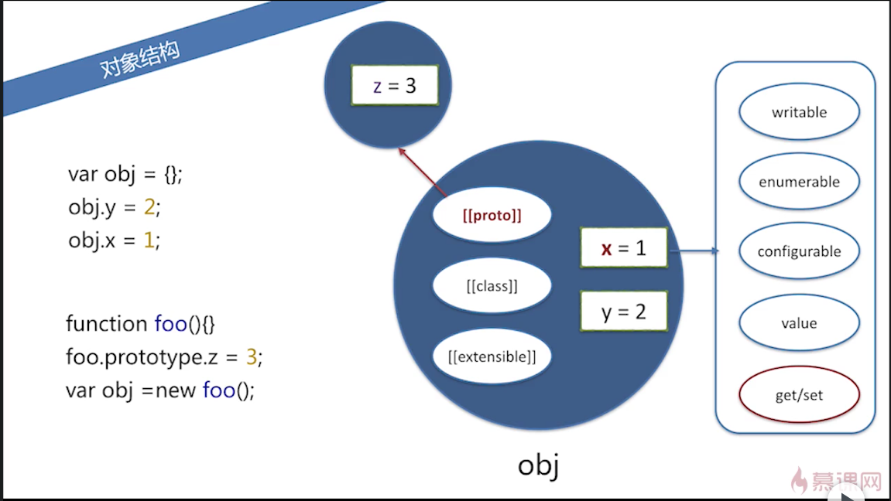
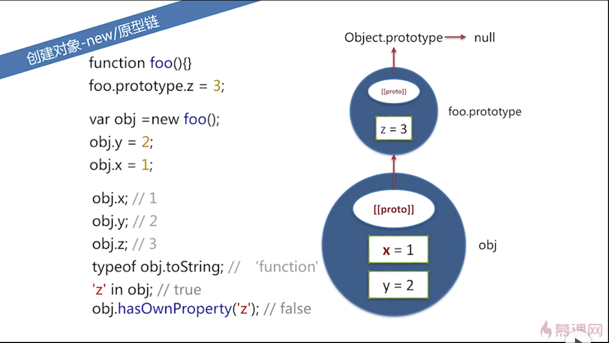
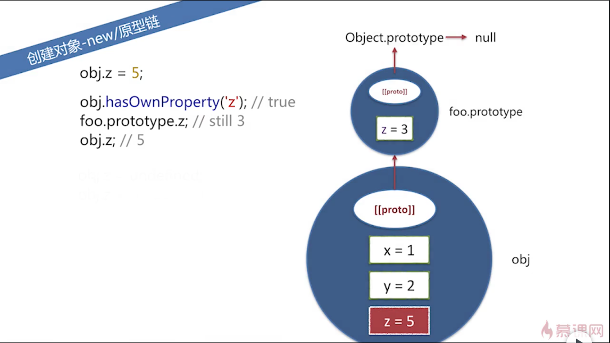
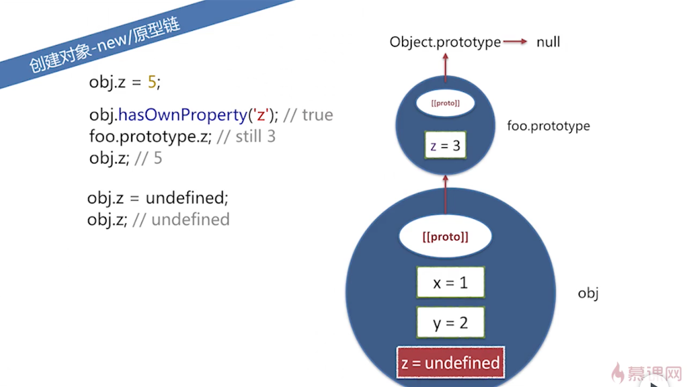
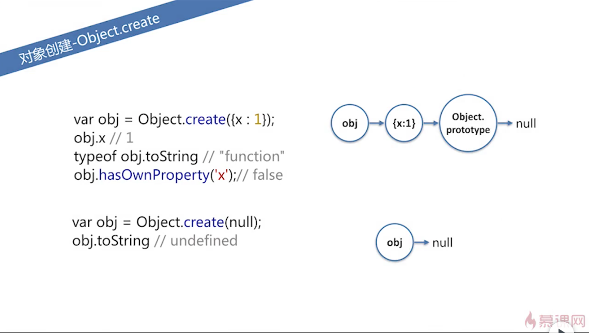
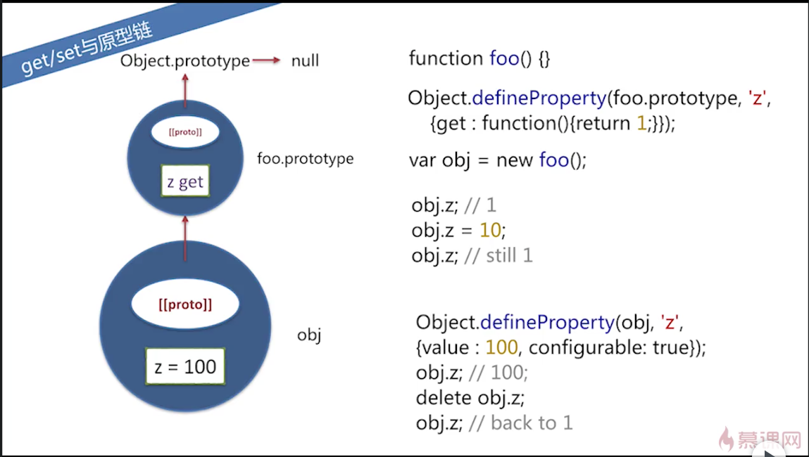
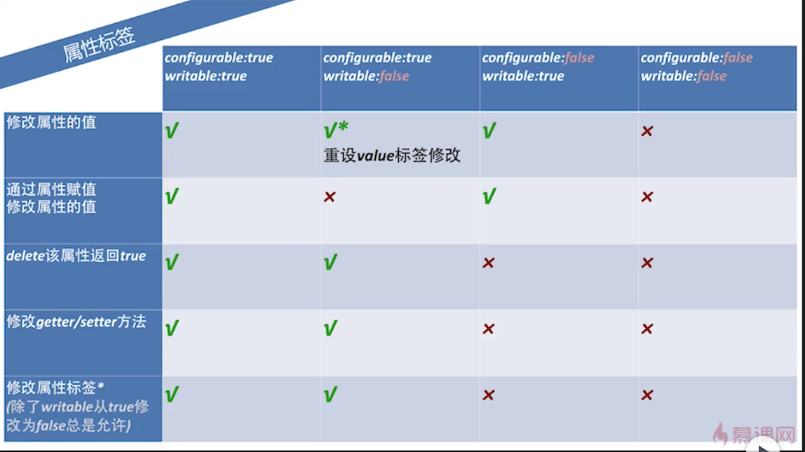
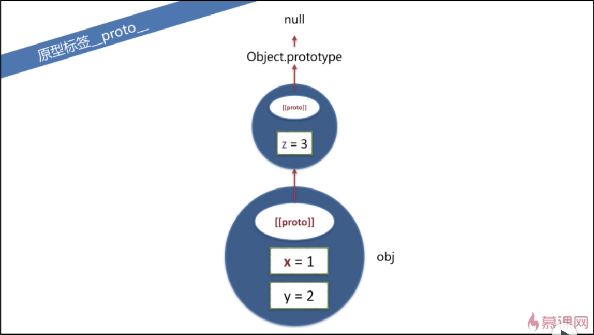

# 第 4 章 对象概述

## 4 - 1 对象概述

### 概述

对象中包含一系列属性，这些属性是**无序**的。
每个属性都有一个**字符串 key**和对应的 value。

```js
var obj = {}
obj[1] = 1
obj['1'] = 2
obj // Object {1: 2}
// 上面可以看错，不管是数字型的1作为属性，还是字符串型的'1'作为属性，他们指向同一个属性。

obj[{}] = false
obj[{ x: 1 }] = true
obj // Object {1:2, [object Object]: true}
// 同样，这里不管是空对象，还是属性x为1的对象作为key，都是把它们toString()之后作为key，他们最终指向同一个属性。
```

### 对象结构

对象的每个属性都有一些便签，比如：

- writable
- enumerable
- configurable
- value
- get/set
- `__proto__`
- 等等

图示：



## 4 - 2 创建对象、原型链

### 对象创建-字面量

`var obj1 = {x: 1, y: 2};`

### 对象创建-new/原型链

使用 new 构造对象的好处，对象的原型会指向构造器的 prototype 属性。

当访问一个对象的属性时，先看该对象有没有这个属性，如果有就使用该对象的该属性值，如果没有，则向上查找该对象的原型链上有没有这个属性。
当查找到最后的 prototype 为 null 时还没有查找到，就返回 undefined.

注意`in`和`hasOwnProperty`的区别。

原型链示意图：



但是，当给对象的属性赋值的时候，不会通过原型链向上查找。
也就是说，当给对象的属性赋值时，会看这个对象上有没有这个属性，如果有，直接修改属性的值；
如果没有，直接在这个对象上新加这个属性，而不会修改对象原型链上的值。

示意图：



如果给一个对象的属性赋值为 undefined 的话，这个属性还是存在的，只不过值为 undefined。
所以，如果访问一个对象的属性时返回 undefined，不一定是对象没有这个属性，可能是有这个属性，只不过值为 undefined。
此时，可以通过`hasOwnProperty`和`in`来区分。

如果所示：



那么，如果要删掉对象的属性的话，使用`delete obj.z`去删除，删除后就可以通过`obj.z`访问到原型链上的值了。
但是，如果继续`delete obj.z`的话，是不起作用的。
也就是说，delete 只会删掉对象上的属性，而原型链上的属性不会受影响。

这样的话，就通过原型链实现了继承，对象可以访问原型链上的属性，但是有不会修改原型链上的属性。

### 对象创建-`Object.create`

除了用原型之外，还可以通过`Object.create`这个内置函数来创建对象。
这个方法的作用是，创建一个对象，并且让这个对象的原型执行这个方法的参数。

如果所示：



使用 obj.x 可以访问，但是这个 x 是 obj 的原型链上的，所以，hasOwnProperty 返回 false。

并不是所有对象的原型链末端都是 Object.prototype，也就是说不是说有的对象都有 toString 方法。

比如上图所示，使用`Object.create(null)`创建的对象，它的原型直接就是 null 了，所以这个对象就不会 包含任何方法。

## 4 - 3 属性操作

### 属性读写

使用`obj.x`或`obj['y']`形式。

使用`for...in`遍历属性时，会把原型链上的东西遍历出来，并且他的顺序时不确定的。

```js
var p
for (p in obj) {
  console.log(obj[p])
}
```

### 属性读写-异常

使用`obj.x = y`时，如果 x 属性存在就赋为 y，如果不存在就新建 x 属性，并赋值。

### 属性删除

使用`delete obj.x`或`delete obj[x]`形式删除，删除之后 obj.x 就变为 undefined。

如果去删除不存在的属性，js 不去做任何事情，但是仍然返回 true，所以，返回 true 并不代表它删除成功了，而是说这个对象上不存在这个属性了。

但是，有些属性是不允许删除的，这时会返回 false，比如：

```js
delete Object.prototype // false
```

每个属性都有自己的一些权限配置，我们可以通过下面的方式获取：

```js
var descriptor = Object.getOwnPropertyDescriptor(Object, 'prototype')
descriptor.configurable // false
```

除此之外，使用 var 定义的全局变量或局部变量，仍然不能被删除，虽然它不是对象的属性。比如：

```js
var globalVal = 1
delete globalVal // false;
;(function () {
  var localVal = 1
  return delete localVal
})() // false

// 同理，函数也一样
function fd() {}
delete fd // false
;(function () {
  function fd() {}
  return delete fd
})() // false

// 注意，不使用var定义的这种可以删除。
ohNo = 1
window.ohNo // 1
delete ohNo // true

// 还有中情况，eval里定义的变量是可以删除的。
eval('var a = 1;')
delete a // true
```

### 属性检测

可以使用 in 操作符来检测，它能访问原型链上的属性，可以用 hasOwnProperty 来检测是否是原型链上的属性。

但是，使用 in 遍历时，不是每个属性都会输出，可以使用`obj.propertyIsEnumerable('x')`的形式来判断属性是否可以被枚举。

我们可以使用 defineProperty 来自定义属性，并且可以设为不可枚举。

```js
Object.defineProperty(cat, 'price', { enumerable: false, value: 1000 })
cat.propertyIsEnumerable('price') // false
cat.hasOwnProperty('price') // true
```

我们使用对象字面量或者`new`创建的对象，或者赋值创建的属性，它的属性都是可读可写，也是可以枚举，也可以 delete 掉。

而使用 defineProperty 创建的属性，如果不指定的话，它的标签都是 false 的，比如上面的 enumerable 不写也可以，默认 false。

补充，`if (a != undefined)`，等价于`if (a !== undefined || a !== null)`，不使用严格等于时，undefined 跟 null 当成一个东西。

### 属性枚举

可以使用 propertyIsEnumerable 或者 hasOwnProperty 来枚举。
注意，使用`var obj = Object.create(xxx)`创建出来的对象，它的原型指向后面的参数，比如这个 obj 的原型指向 xxx。

## 4-4 get/set 方法

### getter/setter 使用

Getter/Setter 的使用，是使用 get/set 关键字，加上字段名，紧接着跟着方法体。

Getter/Setter 跟其他属性之间，依然使用逗号隔开。

```js
var man = {
  name: 'Bosn',
  weibo: '@Boson',
  get age() {
    return new Date().getFullYear() - 1988
  },
  set age(val) {
    console.log("Age can't be set to " + val)
  },
}

console.log(man.age) // 27
man.age = 100 // Age can't be set to 100
console.log(man.age) // 27
```

一个稍微复杂的例子：

```js
var man = {
  name: 'Bosn',
  weibo: '@Boson',
  $age: null, // 这里使用$，是为了不想把这个变量暴露给外面。注：实际man.$age还是可以访问的
  get age() {
    if (this.$age == undefined) {
      // 这里没有使用严格等于，所以，这里实现了null和undefined判断
      return new Date().getFullYear() - 1988
    } else {
      return this.$age
    }
  },
  set age(val) {
    val = +val // 这里使用一元操作符+，可以将字符串转为数值。注：+不会将负值转为正值，+(-10)为-10
    if (!isNaN(val) && val > 0 && val < 150) {
      this.$age = +val
    } else {
      throw new Error('Incorrect val = ' + val)
    }
  },
}

console.log(man.age) // 27
man.age = 100
console.log(man.age) // 100
man.age = 'abc' // error: Incorrect val = NaN 注：这里是NaN，而不是'abc'，因为在val = +val中就出错了。+'abc'为NaN
// 如果去掉val = +val，执行man.age = 'abc'时，返回：Incorrect val = abc
man.age = -10 // error: Incorrect val = -10
```

### get/set 与原型链

如图所示：



`obj.z; // 1`

右上部分，为 foo.prototype 定义了一个 z 的 get 方法，使用 obj.z，由于 obj 中没有 z，所以向上查找原型链，得到原型上的 get 方法，所以返回 1。

```js
obj.z = 10
obj.z // still 1
```

给 z 赋值时，由于 obj 上没有 z，按之前的讲解，应该会在 obj 上创建一个 z 属性，但是这里是失败了，因为仍然返回 1。

原因是，当 obj 上没有这个属性时，并且 obj 的原型链上有对应的 get/set 方法时，当对属性赋值时，它会走原型链上对应的 get/set 方法，而不会做对当前对象创建新属性的方式这样的处理。

那么，如果实现对 obj 上这样的属性进行修改呢。我们可以通过`Object.DefineProperty`来添加新属性。

如右下所示，使用`configurable: true`来指定属性可以被修改，这里没有指定 writebale 和 enumerable，所以默认是 false。

## 4 - 5 属性标签

### 查看属性标签

查看一个对象上的属性有哪些属性标签使用`Object.getOwnPropertyDescriptor(obj, prop)`，如下所示：

```js
Object.getOwnPropertyDescriptor({ pro: true }, 'pro')
// Object {value: true, writable: true, enumerable: true, configurable: true}
// value: 属性的值
// writable: 属性是否可修改，默认为true
// enumerable: 属性是否可以被遍历，可被枚举(for..in或者Object.keys('xx'))，默认为true
// configurable: 是表示这些属性标签是否可以再被修改，另外，也表示是否可以通过delete去删除这个属性，默认为true

Object.getOwnPropertyDescriptor({ pro: true }, 'a') // undefined
// 如果去获取一个不存在的属性的属性标签，将返回undefined

// 定义属性使用Object.defineProperty
// 第一个参数为对象，
// 第二个参数为属性名
// 第三个参数为属性标签对象
var person = {}
Object.defineProperty(person, 'name', {
  configurable: false,
  writable: false,
  enumerable: true,
  value: 'Bosn Ma',
})

// 运行结果
person.name // Bosn Ma
person.name = 1
person.name // still Bosn Ma
// 上面的name没有赋值成功，因为writable为false
delete person.name // false
// delete也不成功，因为configurable为false
```

一次性定义多个属性时，使用`Object.defineProperties(obj, properties)`，注意这里是复数形式。

第一个参数为对象，第二个参数是一个属性对象，这个对象的 key 是对象的属性，值为属性描述。

```js
Object.defineProperties(person, {
  title: { value: 'fe', enumerable: true },
  corp: { value: 'BABA', enumerable: true },
  salary: { value: 50000, enumerable: true, writable: true },
})

Object.getOwnPropertyDescriptor(person, 'salary')
// Object {value: 50000, writable: true, enumerable: true, configurable: false}
// 使用defineProperty定义时，没有明确知道的标签，默认为false

Object.getOwnPropertyDescriptor(person, 'corp')
// Object {value: 'BABA', writable: false, enumerable: true, configurable: false}
```

属性的标签是可以重复设置的，我们可以再次使用 defineProperty 去修改对应属性的标签。

不同的标签是做不同的事情的，如下所示：


::: tip
如果 configurable 为 true，即使其他标签为 false 也是可以被修改的，因为可以使用 defineProperty 再次定义为 true。
:::

## 4 - 6 对象标签，对象序列化

### 对象标签

- [[proto]]
- [[class]]
- [[extensible]]

### 原型标签**proto**



### class 标签

没有直接的方式获取 class 标签，可以通过间接的方式`Object.prototype.toString`获取。

```js
var toString = Object.prototype.toString
function getType(o) {
  return toString.call(o).slice(8, -1) // 从第9位截取，-1代表从后面数1位，即不包含最后一位。
}

toString(null) // [object Null]
getType(null) // Null
getType(undefined) // Undefined
getType(1) // Number
getType(new Number(1)) // Number
typeof new Number(1) // object
getType(true) // Boolean
getType(new Boolean(true)) // Boolean
```

### extensible 标签
