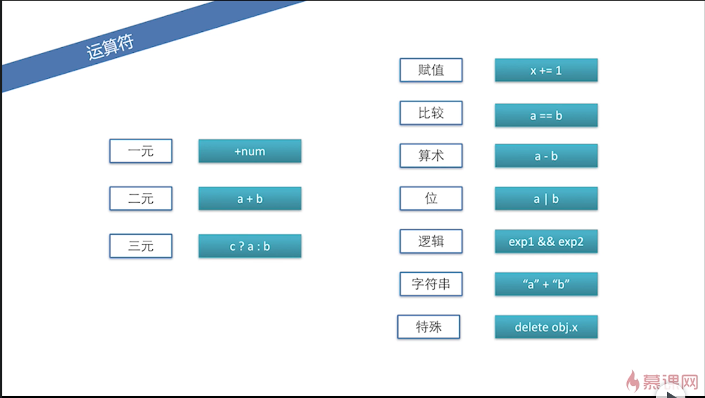

# 第 2 章 表达式和运算符

## 2-1 表达式

### 原始表达式

- 常量、直接量
- 关键字
- 变量

原始表达式和原始表达式可以复合成复合表达式，比如`10 * 20`就是两个原始表达式通过运算符构成了复合表达式。

### 数组、对象的初始化表达式

比如：

|       表达式 | 等价表达式                                   |
| -----------: | :------------------------------------------- |
|       [1, 2] | new Array(1, 2)                              |
|   [1, , , 4] | [1, undefined, undefined, 4]                 |
| {x: 1, y: 2} | var o = new Object();<br />o.x = 1; o.y = 2; |

### 函数表达式

把函数赋给一个变量，或者，把函数用括号阔起来直接调用,这样的就是函数表达式。

比如：

```js
var f = function () {}

;(function () {
  console.log('Hello World!')
})()
```

### 属性访问表达式

如下：

```js
var o = { x: 1 }
o.x
o['x']
```

### 调用表达式

比如：`func();`。

### 对象创建表达式

比如：

```js
new Func(1, 2)
new Object() // 无参数时，括号可以省略。
```

## 2-2 运算符

### 常见的运算符

- 一元运算符

  比如：`+num`，`+`可以将字符串转换成数字，`-`可以将字符串转换成数字；也可以正数变负数，负数变正数。

- 二元运算符

  比如：`a + b`

- 三元运算符

  比如：`c ? a : b`，它会将`c`强制转换为布尔型去比较。

除此之外，还有其他运算符：



### 逗号运算符`,`

`var val = (1, 2, 3); // val = 3`

逗号运算符是从左往右依次计算表达式的值，最后取最右边的值。

### `delete`运算符

```js
var obj = { x: 1 }
obj.x // 1
delete obj.x
obj.x // undefined
```

后来新增了一个`Object.defineProperty`，可以给对象新增属性，或者修改已经存在的属性，并返回改对象。但不是说有的属性都能`delete`，只有定义的时候，`configurable: true`的才可以`delete`。

例：

```js
var obj = {}
Object.defineProperty(obj, 'x', {
  configurable: false,
  value: 1,
})
delete obj.x // false
obj.x // 1
```

### `in`运算符

使用`in`运算符来判断一个对象里有没有特定的`key`。

```js
window.x = 1
'x' in window // true
```

### instanceof, typeof 运算符

`instanceof`判断对象的类型，基于原型链判断。

`typeof`返回一个字符串，一般用来判断原始类型或者函数对象。

```js
{} instanceof Object; // true
typeof 100 === 'number'; // true
```

### `new`运算符

可以通过`new`来创建一个构造器的实例。

```js
function Foo() {}
Foo.prototype.x = 1
var obj = new Foo()
obj.x // 1
obj.hasOwnProperty('x') // false
obj.__proto__.hasOwnProperty('x') // true
```

可以通过`hasOwnProperty`来判断一个属性到底属于这个对象上的，还是这个对象原型链上的。

可以通过`__proto__`拿到这个对象的原型。

### `this`运算符

`this`比较复杂，后面会详细再说。

```js
this // window（浏览器）
var obj = {
  func: function () {
    return this
  },
}
obj.func() // obj
```

注：上面的`obj.func`，在 chrome 78.0.3904.108 中，返回`obj.func`对象。

注：可以使用`apply`改变`this`指向。

### `void`运算符

无论`void`后面是多少，都会返回`undefined`。

```js
void 0 // undefined
void 0 // undefined
```
