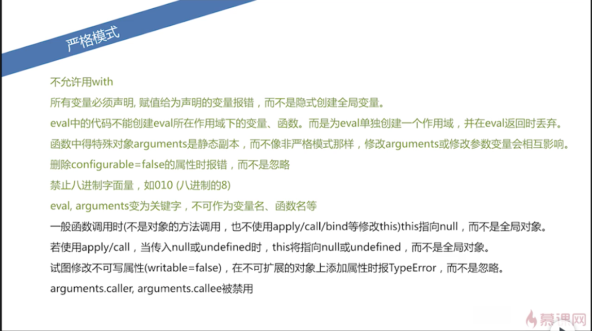

# 第 3 章 语句

## 3-1 block 语句、var 语句

### 块 block

块语句常用于组合 0~多个语句。块语句用一对花括号定义。

语句：

```txt
{
  语句1;
  语句2;
  ...
  语句N;
}
```

请注意：没有块级作用域。

### 定义 var

::: tip
使用一个`var`定义多个变量时，后面的变量会被隐式的创建为全局变量。
:::

比如：

```js
function foo() {
  var a = (b = 1)
}
foo()

console.log(typeof a) // undifined
console.log(typeof b) // number
```

所以，如果一行里面定义多个变量时，应用逗号分割。

## 3-2 try-catch

```js
try {
  throw 'test'
} catch (ex) {
  console.log(ex) // test
} finally {
  console.log('finally')
}
```

try 后面跟着 catch 或者 finally.

```js
try {
  try {
    throw new Error('oops')
  } finally {
    console.log('finally')
  }
} catch (ex) {
  console.error('outer', ex.message)
}
```

结果为：

```md
finally
outer oops
```

## 3-3 函数、swith、循环

### function

函数声明：

```js
function fd() {
  // do sth.
  return true
}
```

函数表达式：

```js
var fe = function () {
  // do sth.
}
```

两者比较重要的一个区别：函数声明会被预先处理，也叫函数前置，所以在函数声明的前面调用也是可以的，但是函数表达式却不可以。

也可通过`new Function`来定义，具体区别稍后讨论。

### for...in

```js
var p
var obj = { x: 1, y: 2 }
for (p in obj) {
  // do sth.
}
```

::: tip

1. 顺序不确定
2. enumerable 为 false 时不会出现
3. for in 对象属性时受原型链影响

:::

### switch

```js
var val = 2

switch (val) {
  case 1:
  case 2:
  case 3:
    console.log(123)
    break
  case 4:
  case 5:
    console.log(45)
    break
  default:
    console.log(0)
}

// 123
```

### 循环

```js
while (isTrue) {
  // do sth.
}

do {
  // do sth.
} while (isTrue)

var i
for (i = 0; i < n; i++) {
  // do sth.
}
```

### with

with 可以修改作用域。

```js
with ({ x: 1 }) {
  console.log(x)
}

with (document.forms[0]) {
  console.log(name.value)
}
```

JavaScript 中，已经不建议使用 with.

- 让 JS 引擎优化困难
- 可读性差
- 可被变量定义代替
- 严格模式下被禁用

## 3-4 严格模式

严格模式是一种特殊的执行模式，它修复了部分语言上的不足，提供更强的错误检查，并增强安全性。

如何使用：

```js
// 限制某个方法，在方法的第一句
function func() {
  'use strict' // 好处是，如果旧的浏览器不支持严格模式，这句话会被作为一个普通的字符串
}

// 也可以在.js文件的开头加
;('use strict')
function func() {}
```

坑：'use strict'不一定非要在第一句，如果前面是'a','b'也是可以的，但是`var a; var b;`这种是不行的。

### 不允许使用 with，SyntaxError

### 不允许未声明的变量被赋值

```js
!(function () {
  'use strict'
  x = 1
  console.log(window.x)
})()

// ReferenceError
```

如果不加`'use strict'`，`x` 会是一个全局变量。

### arguments 变为参数的静态副本

```js
!(function (a) {
  arguments[0] = 100
  console.log(a)
})(1)

// 参数为1时，由于内部修改了，所以结果为100
// 但是，参数不传时，a为undefined，单机原来的参数不会被改，还是undefined
```

如果加上`'use strict'`的话，arguments 只是参数的副本，所以不会影响原来的参数，所以结果为 1.

如果参数是一个`object`的话，由于 js 是 call by sharing，所以，修改了对象的属性的值，会保持下来。

### delete 参数、函数名报错

```js
!(function (a) {
  console.log(delete a)
})(1)

// false

!(function (a) {
  'use strict'
  delete a
})(a)

// SyntaxError
```

### delete 不可配置的报错

```js
!(function (a) {
  var obj = {}
  Object.defineProperty(obj, 'a', { configurable: false })
  console.log(delete obj.a)
})(1)

// false

!(function (a) {
  'use strict'
  var obj = {}
  Object.defineProperty(obj, 'a', { configurable: false })
  console.log(delete obj.a)
})(1)

// TypeError
```

### 对象字面量重复属性名报错

```js
!(function () {
  var obj = { x: 1, x: 2 }
  console.log(obj.x)
})()

// 2

!(function () {
  'use strict'
  var obj = { x: 1, x: 2 }
  console.log(obj.x)
})()

// SyntaxError
```

### 禁止八进制字面量

```js
!(function () {
  console.log(0123)
})()

// 83

!(function () {
  'use strict'
  console.log(0123)
})()

// SyntaxError
```

### eval, arguments 变为关键字，不能作为变量、函数名

```js
!(function () {
  function eval() {}
  console.log(eval)
})()

// function eval() {}

!(function () {
  'use strict'
  function eval() {}
  console.log(eval)
})()

// SyntaxError
```

### eval 独立作用域

```js
!(function () {
  eval('var evalVal = 2;')
  console.log(typeof evalVal)
})()

// number

!(function () {
  'use strict'
  eval('var evalVal = 2;')
  console.log(typeof evalVal)
})()

// undefined
```

### 其他



严格模式是一种特殊的运行模式，它修复了部分语言上的不足，提供更强的错误检查，并增强安全性。
