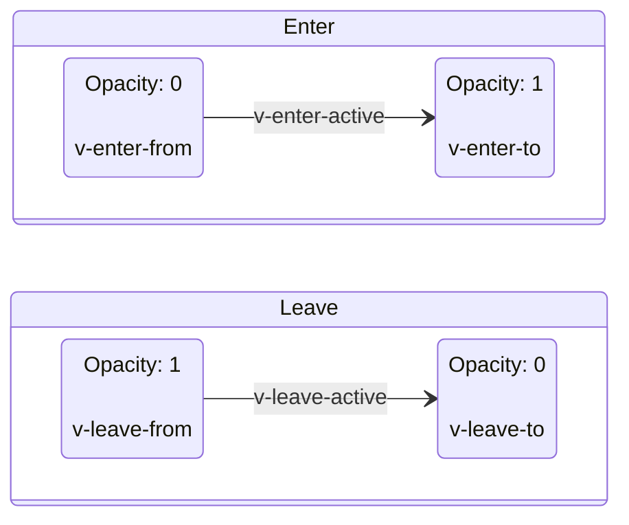

# Transition

Vue 提供了两个内置组件，可以帮助你制作基于状态变化的过渡和动画：

- `Transition` 会在一个元素或组件进入和离开 DOM 时应用动画。
- `TransitionGroup` 会在一个元素或组件被插入到 `v-for` 列表中，或是被移动或从其中移除时应用动画。

除了这两个组件，我们也可以通过其他技术手段来应用动画，比如切换 CSS class 或用状态绑定样式来驱动动画。

## `Transition` 组件

它可以将进入和离开动画应用到通过默认插槽传递给它的元素或组件上。进入或离开可以由以下的条件之一触发：

- 由 `v-if` 所带来的条件渲染
- 由 `v-show` 所带来的条件显示
- 由特殊元素 `<component>` 切换的动态组件

最基本的示例：

::::: playground transistion 示例
:::: code-group
::: code-group-item App.vue

```vue
<template>
  <button @click="show = !show">Toggle</button>
  <Transition>
  <p v-if="show">hello</p>
  </Transition>
</template>

<script setup>
import { ref } from 'vue'

const show = ref(true)
</script>

<style>
.v-enter-active,
.v-leave-active {
  transition: opacity 0.5s ease;
}
.v-enter-from,
.v-leave-to {
  opacity: 0;
}
</style>
```

:::
::::
:::::

::: tip
`<Transition>` 仅支持单个元素或组件作为其插槽内容。如果内容是一个组件，这个组件必须仅有一个根元素。
:::

当一个 `Transition` 组件中的元素被插入或移除时，会发生下面这些事情：

1. Vue 会自动检查目标元素是否应用了 CSS 过度或动画。如果是，则一些 CSS 过度 class 会在适当的时机被添加或移除。
2. 如果有作为监听器的 JavaScript 钩子，这些钩子函数会在适当时机被调用。
3. 如果没有探测到 CSS 过度或动画，没有提供 JavaScript 钩子，那么 DOM 的插入，删除操作将在浏览器的下一个动画帧上进行。

## 基于 CSS 的过渡

### CSS 过渡 class

一共有 6 个应用于进入与离开过渡效果的 CSS class。



::: tip mermaid escapse
Numbers given are base 10, so `#` can be encoded as `#35;`. It is also supported to use HTML character names.

Because semicolons can be used instead of line breaks to define the markup, you need to use `#59;` to include a semicolon in message text.

冒号 `:` = `#58;`, 空格 `&nbsp;`，换行 `<br />`，减号 `-` = `#45;`
:::

1. `v-enter-from`：进入动画的起始状态。在元素插入之前添加，在元素插入完成后的下一帧移除。
2. `v-enter-active`：进入动画的生效状态。应用于整个进入动画阶段。
   在元素被插入之前添加，在过渡或动画完成之后移除。这个 class 可以被用来定义进入动画的持续时间、延迟与速度曲线类型。
3. `v-enter-to`：进入动画的结束状态。在元素插入完成后的下一帧被添加 (也就是 `v-enter-from` 被移除的同时)，在过渡或动画完成之后移除。
4. `v-leave-from`：离开动画的起始状态。在离开过渡效果被触发时立即添加，在一帧后被移除。
5. `v-leave-active`：离开动画的生效状态。应用于整个离开动画阶段。在离开过渡效果被触发时立即添加，在过渡或动画完成之后移除。
   这个 class 可以被用来定义离开动画的持续时间、延迟与速度曲线类型。
6. `v-leave-to`：离开动画的结束状态。在一个离开动画被触发后的下一帧被添加 (也就是 `v-leave-from` 被移除的同时)，在过渡或动画完成之后移除。

`v-enter-active` 和 `v-leave-active` 给我们提供了为进入和离开动画指定不同速度曲线的能力。
