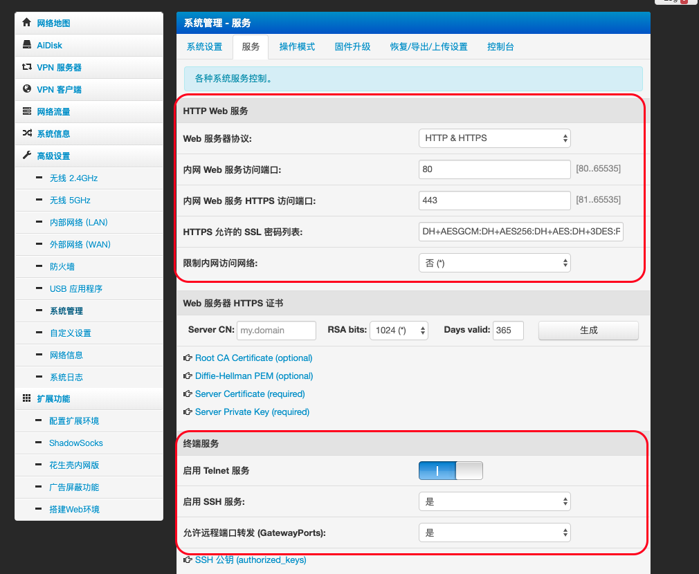
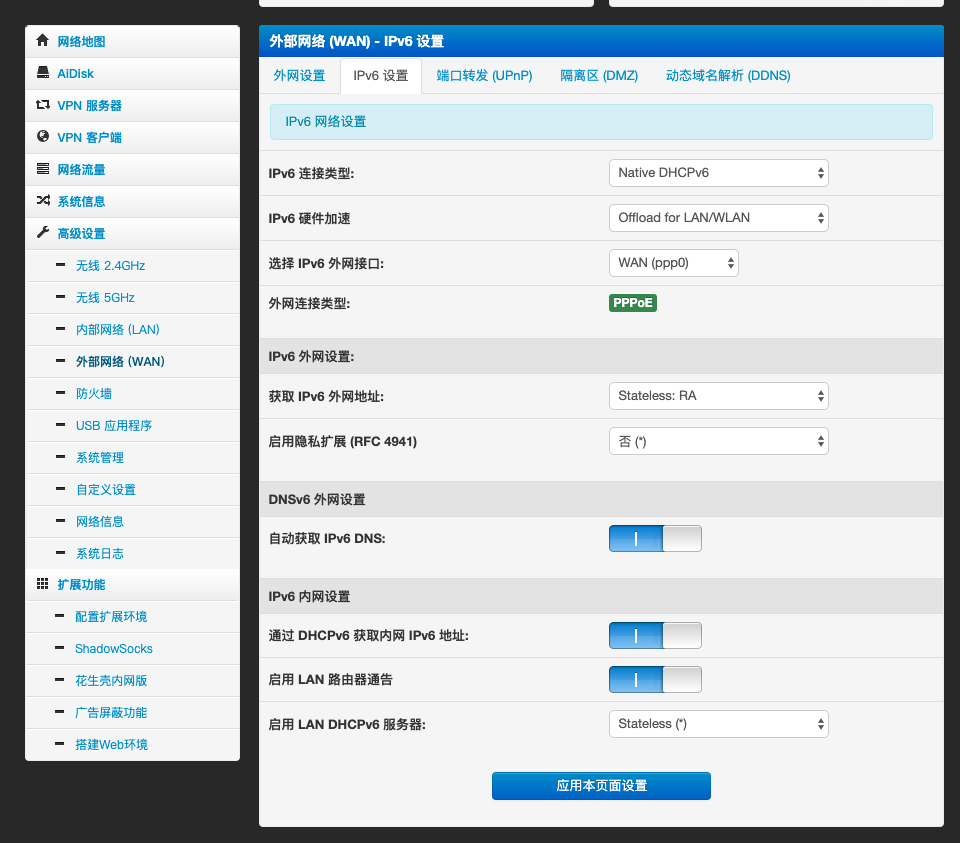

# 路由器折腾笔记

## 刷机

路由器型号为 newifi3-d2，咸鱼上『拣』的垃圾，当然不是免费的，为了 d2 版本挑拣的矿机。

到手后，刷了 breed，然后刷了 padavan，本人小白，所以选了 padavan。

之前很早的时候，newifi1 用过 openwrt，主要看中的是多拨，后来升级带宽，感觉够用了，而且感觉多拨也没怎么提升，padavan 功能整合的挺好就刷了 padavan，所以就一直沿用下来了。

（多拨没提升，估计是我网线的事，原来埋的是百兆线，padavan 上没多拨也是个遗憾吧）

## padavan 外网访问

路由器刷了 padavan 后感觉功能很强大，但是基本没啥用，但是总想搞事情。

逛恩山论坛后，看到大家在刷翻墙，奈何自己没服务器，只能作罢。还看到大家在搞外网访问，虽然自己没啥用，但是感觉大家在搞，我也想搞搞，而且自己也正好有域名。

但是，之前买的 3 年的域名到期了，看着续费也不便宜（其实是穷。。。），自己不怎么用，所以就不续费了。新注册反而更便宜，那还是新注册个吧，反正之前的域名也没啥用。。。

鉴于上次买的域名时间短，这次想搞个时间长的，省得续费还贵，一次性搞了 10 年，对比了一下虽然腾讯域名比阿里域名便宜一点，但是鉴于腾讯的也不能用 Q 币（正好有闲置），而且之前阿里上的域名也都用过，所以还是选择了阿里。

上面废话了一通，这次回归正题，按以下几点实现外部访问。

1. 自己有域名后，可以配合 padavan 的`Aliddns`功能解析到域名下。
   - 配置阿里域名，获取 Access Key 的相关信息，使用`RAM 用户`，配置了`管理云解析（DNS）的权限`和`管理域名服务的权限`。
   - 使用`Aliddns`配置。[配置链接](http://192.168.123.1/Advanced_Extensions_aliddns.asp)：`http://192.168.123.1/Advanced_Extensions_aliddns.asp`
2. 确保开启了路由的`HTTP Web 服务`
   - [配置链接](http://192.168.123.1/Advanced_Services_Content.asp)：`http://192.168.123.1/Advanced_Services_Content.asp`
   - 开启 HTTP & HTTPS 服务，如下所示：
     
   - 此处同时开启了 ssh 服务
3. 使用 frp 实现内网穿透

   - [配置链接](http://192.168.123.1/Advanced_Extensions_frp.asp)：`http://192.168.123.1/Advanced_Extensions_frp.asp`
   - 配置脚本`frp_scripts`
     为了简便，这里只说明修改部分。

   ```bash
   # ==========客户端配置：==========
   [common]
   server_addr = 自己的域名
   server_port = 7000
   token = 自己设置一个token，跟服务器端一致即可

   [web]
   type = http
   local_port = 80 # 跟上面HTTP Web服务的的端口保持一致
   remote_port = 自己设置一个端口 # 这里注意一下，一般运营上会屏蔽80端口，使用其他端口。
   custom_domains = 自己的域名

   [https]
   type = https
   local_port = 443 # 跟上面HTTPS Web服务的的端口保持一致
   remote_port = https的端口 # 自己配置一个https的端口
   custom_domains = 自己的域名

   [ssh]
   type = tcp
   local_port = 22
   remote_port = ssh的端口

   # ==========服务端配置：==========
   [common]
   bind_port = 7000
   dashboard_port = 7500
   # dashboard 用户名密码，默认都为 admin
   dashboard_user = admin
   dashboard_pwd = admin
   # 通过自定义域名访问部署于内网的 web 服务
   # https://github.com/fatedier/frp/blob/master/README_zh.md#%E9%80%9A%E8%BF%87%E8%87%AA%E5%AE%9A%E4%B9%89%E5%9F%9F%E5%90%8D%E8%AE%BF%E9%97%AE%E9%83%A8%E7%BD%B2%E4%BA%8E%E5%86%85%E7%BD%91%E7%9A%84-web-%E6%9C%8D%E5%8A%A1
   vhost_http_port = 供外网访问的http端口，跟上面的http的remote_port保持一致
   vhost_https_port = 供外网访问的https端口，跟上面的https的remote_port保持一致
   token = 跟客户端的token保持一致
   ```

   - 特别说明
     - http 的`remote_port`遇到过一个坑，最初设置的 8080 能正常范围，后来不知啥时候不能访问了，一开始以为配置错了，各种调整依然不行，后来发现设为别的端口就可以，估计是 8080 也被运营商封掉了。。。
     - https 的 443 也被运行商封掉了，换用其他端口。

4. 配置端口转发
   - 为了定制更多端口转发，我在`外部网络 (WAN) - 端口转发 (UPnP)`中自己设的
   - 也可以在`防火墙 - 通用设置`中开启
5. SSL 证书
   需要启用 https 的话，需要申请免费或购买收费证书，得到正数后，将证书内容填到下面两项内。

   位置：`系统管理 - 服务`

   配置项：

   - Server Certificate (required)
   - Server Private Key (required)

不出意外，就可以外网访问了，如有意外，先检查配置，再网络搜索。

## 开启 IPv6 外网访问

运营上已支持 IPv6，路由里也自动获得了 IPv6。

1. 默认配置：
   
2. Aliddns 的`顶级域名3[IPv6]`配置上，会自动加上 AAAA 记录。
3. `自定义设置 - 脚本 - 在防火墙规则启动后执行:`里加上 IPv6 的防火墙策略

   ```bash
   ### 所需要的防火墙策略
   ip6tables -F
   ip6tables -P INPUT ACCEPT
   ip6tables -P FORWARD ACCEPT
   ip6tables -P OUTPUT ACCEPT
   ```

4. 在 frp 里配置上 IPv6 的节点。
   跟 IPv4 一样，需要注意的是，http/https 可以共用同一个端口，tcp 不能共用同一个端口，需要单独起一个端口供 IPv6 使用，同时端口转发里也加上这个端口。
